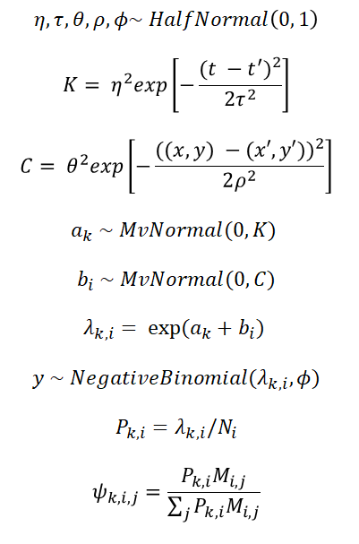
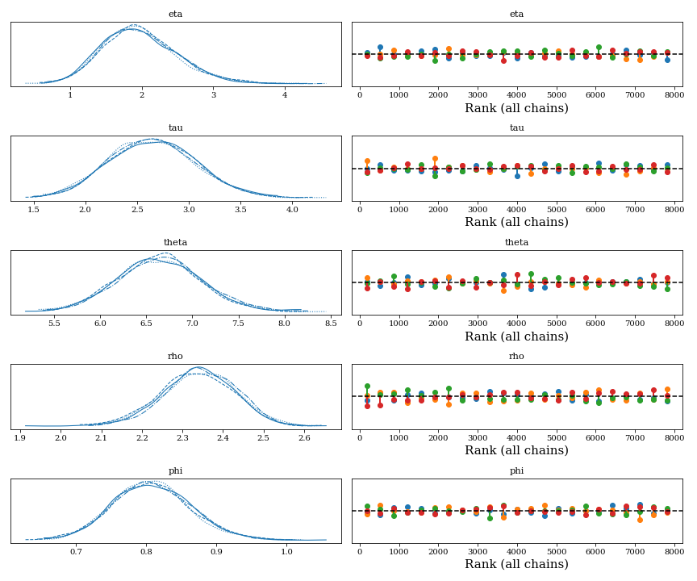
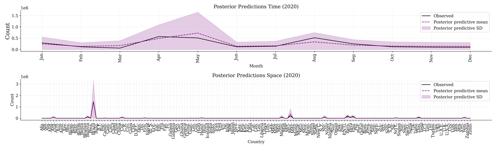
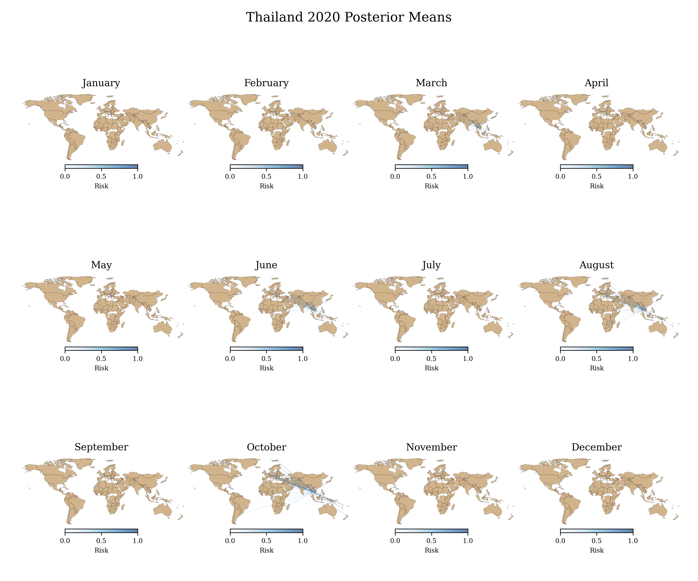
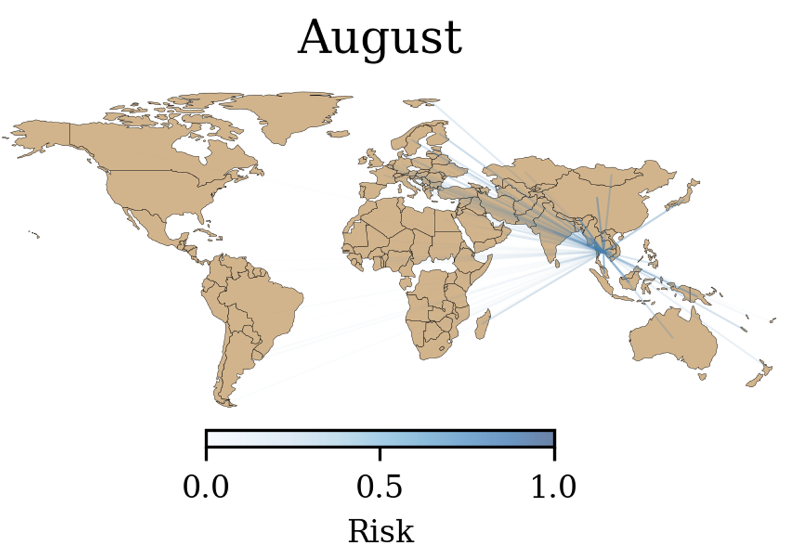

<h1> Global Dengue Import-Export Risk</h1>

	The present preliminary analyses attempt to model dengue exportation risk at a global scale using publicly available data. To facilitate present example, countries with no mobility data available or with low quality geographical and case data were omitted from the analysis. Dengue cases are obtained from: https://opendengue.org/ . Mobility and geographical data from 2020 (Jan-Mar) is from: https://doi.org/10.1073/pnas.2220080120 .

<h1> Model </h1>
For the monthly local case estimate we use a log-Gaussian Cox process (LGCP) intensity &lambda;k,i, with <i>k</i> months and <i>i</i> origin countries, as dengue cases estimate, which parametrises the mean of negative binomial distribution. Risk of importing/exporting cases is then calculated as the proportion of infected people in an country <i> Pk,i =  &lambda;k,i / Ni</i>, where <i>Ni</i> is the country's population, by the air mobility matrix <i>Mi,j</i> and normalised by the sum of this product over destination countries, namely: risk = <i> &psi;k,i,j = Pk,iMi,j / &Sum;jPk,iMi,j</i>  </i>.  

	

Where &eta; and &theta; are maximum covariance parameters, &tau; is a time scale, &rho; is a space scale, <i>K</i> and <i>C</i> are covariance matrices for months <i>t</i> and countries <i>i</i> respectively, <i>ak</i> and <i>bi</i> are time and space Gaussian processes respectively, &lambda;k,i is an intensity parameter resulting from adding up the Gaussian processes, <i>y</i> is a Negative-Binomial likelihood with mean &lambda;k,i and shape &phi;, <i>Pk,i</i> is the proportion of infected people in a country and &psi;k,i,j is the risk of a country <i>i</i> exporting dengue to another country <i>j</i> (i.e. a country <i>j</i> importing dengue from country <i>i</i>) during a given month <i>k</i> .   

<h1> Results </h1>

 The model sampled relatively well with most parameters showing ESS > 1000 and some ESS > 500, and all showing R-hats ~= 1. Relevant parameters show good chain mixing: 

	

The model, however shows that some parameters within &lambda;k,i are harder to sample (lower ESS) and does not properly capture uncertainty at lower values, as shown by the posterior predictive distribution:

	

Even so, the model can provide reasonable estimates of seasonal dengue exportation per country. Note that in the estimates for Thailand a closeup on October shows a level of exportations to Europe with a risk of ~ 50% , not inconsistence with previous analyses (see: https://github.com/SimonErnesto/risk_dengue_2015-2019) .  

	

	

<h1> Conclusion </h1>

 The model is able to provide reasonable estimates of importation/exportation spatial-temporal dynamics at a global scale during 2020. Better parametrisations, a more bespoke mobility model and more complete data could help to improve model's convergence and inference.  

